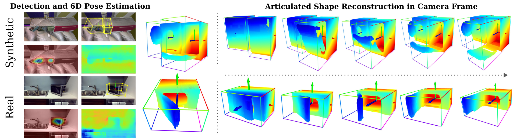

# CARTO: Category and Joint Agnostic Reconstruction of ARTiculated Objects

[Nick Heppert](https://rl.uni-freiburg.de/people/heppert),
[Muhammad Zubair Irshad](https://zubairirshad.com/),
[Sergey Zakharov](https://zakharos.github.io/),
[Katherine Liu](https://www.thekatherineliu.com/),
[Rares Andrei Ambrus](https://www.linkedin.com/in/rare%C8%99-ambru%C8%99-b04812125),
[Jeannette Bohg](https://web.stanford.edu/~bohg/),
[Abhinav Valada](https://rl.uni-freiburg.de/people/valada),
[Thomas Kollar](http://www.tkollar.com/site/)

[**arXiv**](https://arxiv.org/abs/2303.15782) | [**website**](http://carto.cs.uni-freiburg.de) |
*Presented at CVPR 2023, Vancouver B.C., Canada*

<p align="center">
  
</p>

## 📔 Abstract

We present CARTO, a novel approach for reconstructing multiple articulated objects from a single stereo RGB observation. We use implicit object-centric representations and learn a single geometry and articulation decoder for multiple object categories. Despite training on multiple categories, our decoder achieves a comparable reconstruction accuracy to methods that train bespoke decoders separately for each category. Combined with our stereo image encoder we infer the 3D shape, 6D pose, size, joint type, and the joint state of multiple unknown objects in a single forward pass. Our method achieves a 20.4% absolute improvement in mAP 3D IOU50 for novel instances when compared to a two-stage pipeline. Inference time is fast and can run on a NVIDIA TITAN XP GPU at 1 HZ for eight or less objects present. While only trained on simulated data, CARTO transfers to real-world object instances.

## 👨‍💻 Code Release

*This repository is the official implementation*

### Prerequisites

The code was developed and tested under Ubuntu 20.04 and python version 3.8.

Using `conda` setup a new python environment

```[bash]
conda create --name CARTO python=3.8 -y
conda activate CARTO
```

and install all dependencies through (keep the order!)

```[bash]
conda install -c fvcore -c iopath -c conda-forge -c anaconda fvcore iopath pyqt pyyaml -y
conda install -c pytorch -c nvidia pytorch=1.9.1 torchvision pytorch-cuda=11.6 -y
pip install -r requirements.txt
pip install -e .
```

*We observed that for newer versions of OpenCV `PyOpenGL-accelerate` is automatically installed. `PyOpenGL-accelerate` could cause problems and we recommend uninstalling it again.*  

*It can happen that building `Pytorch3D` fails, in that case we kindly refer to their [installation guide](https://github.com/facebookresearch/pytorch3d/blob/main/INSTALL.md).*

Last, install all external libraries needed

```[bash]
current_dir=$(pwd)
external_libs_dir="${current_dir}/external_libs/"
mkdir -p $external_libs_dir
```

#### Manifold

```[bash]
cd $external_libs_dir
git clone git@github.com:PRBonn/manifold_python.git
cd manifold_python
git submodule update --init
make install
cd $current_dir
```

#### A-SDF

```[bash]
cd $external_libs_dir
git clone git@github.com:SuperN1ck/A-SDF.git -b CARTO
cd $current_dir
```

*Feel free to replace this with a submodule*

### Decoder

#### Data Generation

To Generate your own data for training the decoder first, you first need to preprocess [PartNetMobility](https://sapien.ucsd.edu/). Place the downloaded dataset the following way

```[bash]
CARTO/
...
datasets/
  partnet-mobility-v0/
    raw_dataset/
      148/
      149/
      ...
README.md
...
```

Then run the preprocessing script

```[bash]
python scripts/preprocess_partnetmobility.py
```

which should create the `tarballs`-folder and the `index.json.zst`-file

```[bash]
partnet-mobility-v0/
  raw_dataset/
    148/
    149/
    ...
  tarballs/
    0babf424-c85b-4d21-8123-72f3aed070c9.tar.zst
    0d1d667f-1098-4221-8241-25ae8246c215-0.tar.zst
    ...
  index.json.zst
```

To then generate SDF start the following python script

```[bash]
python scripts/generate_sdf_data.py
```

For further information use `--help`. The generated data is saved into `datasets/decoder/generated_data/<NAME>`.

To generate SDF data for all categories present in our real world evaluation data you can use our pre-extracted id-list.

```[bash]
python scripts/generate_sdf_data.py --id-file datasets/decoder/id_lists/All_Real_Categories.txt 
```

Please note the following

- *For CARTO we manually updated some of PartNetMobility's models (mainly `StorageFurniture`), this includes removing dangling coords, adding tops etc. We highly recommend doing the same to ensure realistic reconstructions and reproducibility. See the variable `instance_exclusion_list` in `partnet_mobility.py`.*
- In the main paper evaluation we did not include the categories `Knife`, `Stapler` and `StorageFurniture` but they are included in `All_Real_Categories.txt` and our real image set.
- *You can later adapt for which object instances you want to train the decoder seperately, there is no need to generate seperate datasets for all different category combinations.*
- *Count unique ids in a generated dataset `ls data/arti_recon/shape_pretraining_datasets/<NAME>/ | cut -d "_" -f 1 | sort | uniq -c`*

#### Training

To start a decoder training use

```[bash]
python scripts/decoder_train.py
```

Again, append `--help` to get more information about the usage.

This will save the decoder model under `datasets/decoder/runs/<ID>` and create a wandb run automatically. The local experiment id is either randomly generated or could be changed by passing `--local-experiment-id` to the training script.

During training we cache the SDF values to allow faster loading. To clear the SDF cache use

```[bash]
find datasets/decoder/generated_data/*/sdf_cache/ -depth -delete;
```

#### Pre-Trained Decoder

Download our pre-trained decoder from [here](http://carto.cs.uni-freiburg.de/datasets/506fd5f4-ff54-4413-8e13-6f066f182dfb.tar.gz) and place it under `datasets/decoder/runs/<ID>`. The id is `506fd5f4-ff54-4413-8e13-6f066f182dfb`. E.g. unpack with

```[bash]
tar -xvf 506fd5f4-ff54-4413-8e13-6f066f182dfb.tar.gz --directory=datasets/decoder/runs/
```

To get an understanding how to use the decoder model see notebook `scripts/decoder.ipynb`. Here we plot the embedding spaces as well as show how to reconstruct objects for arbitrary latent codes.

#### Eval

To run a reconstruction evaluation use

```[bash]
python scripts/decoder_eval.py --experiment-id 506fd5f4-ff54-4413-8e13-6f066f182dfb --lod-start 4 --lod 8
```

which places the results in `datasets/decoder/runs/<ID>/eval/reconstruction/<reconstruction_id>/`.

To investigate the results open the jupyter notebook `scripts/decoder_eval_vis.ipynb` in which you can print the statistics for the evaluation run as well as generate reconstructions of the inferred codes.

### Encoder

Download our pre-trained stereo encoder from [here](http://carto.cs.uni-freiburg.de/datasets/14i8yfym.tar.gz) and place it under `datasets/encoder/runs/<ID>`, e.g. unpack with

```[bash]
tar -xvf 14i8yfym.tar.gz --directory=datasets/encoder/runs/
```

We provide an RGB-D version [here](http://carto.cs.uni-freiburg.de/datasets/ienhdj3g.tar.gz). Unpack as above.

#### Data

We provide ~20k synthetic test images and 263 annotated real images. You can download them using the provided script through 

```[bash]
download_archives.sh [real|synthetic]
```

Place them respectively under `datasets/[real|synthetic]/`.

Please note the following things regarding the real data

- *For a visualizaiton of the real data see the notebook under `scripts/real_dataset_vis.ipynb`.*
- *We include nine additional, unlabeled datapoints*
- *The labeling was done using labelCloud. If you find any labels wrong feel free to notify us and we try our best to fix it.*

#### Inference

We provide an inference-script to visualize CARTOs output. Simply run

```[bash]
python scripts/full_inference.py
```

which will place visualizaiton images  `datasets/decoder/runs/<ID>/vis`

For evaluating the full CARTO model, first run

```[bash]
python scripts/full_eval.py
```

which will place evaluation files under `datasets/decoder/runs/<ID>/eval/`.

If you want to evaluate A-SDF, please first download our pre-trained models through `download_archives.sh A-SDF` and place them under `external_libs/A-SDF/examples/CARTO`.

To visulize the results go through the notebook `full_eval_vis.ipynb` under `scripts/`.

## Contribution

Feel free to raise any issues or a PR if anything in this repository is broken, we will give our best to provide you with a solution. Thank you.

## 👩‍⚖️ License

For academic usage, the code and data is released under the [Creative Commons Attribution-NonCommercial 4.0](https://creativecommons.org/licenses/by-nc/4.0/) license.
For any commercial purpose, please contact the authors.

## 🤝 Acknowledgements
<!-- Toyota Research Institute (TRI) provided funds to assist the authors with their research but this article solely reflects the opinions and conclusions of its authors and not TRI or any other Toyota entity. -->
This work was partially funded by the Carl Zeiss Foundation with the ReScaLe project.

---

If you find our work useful, please consider citing our paper:

```
@inproceedings{heppert2023carto,
 title={CARTO: Category and Joint Agnostic Reconstruction of ARTiculated Objects},
 author={Heppert, Nick and Irshad, Muhammad Zubair and Zakharov, Sergey and Liu, Katherine and Ambrus, Rares Andrei and Bohg, Jeannette and Valada, Abhinav and Kollar, Thomas},
 booktitle={Proc. IEEE Conf. Comput. Vis. Pattern Recog.},
 year={2023},
 pages={21201-21210}
}
```
